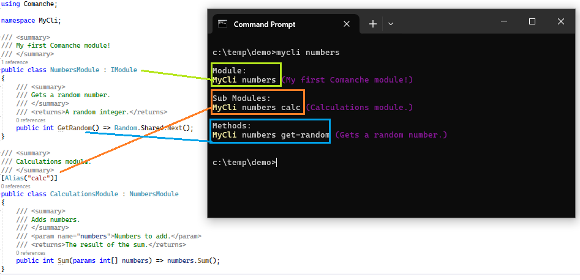

# Comanche
## Overview
Comanche is a module-discovery library for the command line. 

It is designed to work for *you, the developer* by quietly allowing you to write code. It then also works for your CLI consumers, by dynamically discovering your code and seemlessly relaying it (the parts you choose).

## Quick Start
Getting started is as easy as 1, 2, 3!

1. Add the latest `Comanche` package to your console app, enabling "generate documentation file" is also recommended!
2. Write some code
3. Call Comanche's `Discover.Go()` from your Program.cs

Now you can build and ship your exe as normal..

.. But **please keep reading!** There are many more time-saving features to explore below.


## Development Guide
This section provides guidance on how to make use of all of the features and functionality of Comanche!
### Structure
All commands are made available in the following format:

> `assembly`&nbsp;&nbsp;`module`&nbsp;&nbsp;`[..sub-modules]`&nbsp;&nbsp;`method`&nbsp;&nbsp;`[..params]`

Therefore you can organise your coding entities to yield your desired CLI experience and to make for the most intuitive user experience.



#### Modules
A Comanche Module is the direct equivalent to a C# `class`. As well as its own methods, it can also contain nested classes, which become sub-modules in Comanche.

By default, Comanche discovery attempts to expose *all* public classes in the console app to the CLI. To prevent a class from being exposed, there are several supported options:

- Decorate the classes you do *not* wish to expose with the `[Hidden]` attribute
- Set the `moduleOptIn` parameter to `true` in the call to `Discover.Go()`.  In this mode, only modules decorated with the `[Module]` attribute will be exposed to the CLI. (This also allows for an alias to be provided to the module, as per the above screenshot)
- Modify the class access to a non-public scope, such as `internal` or `private` (if appropriate)

Also by default is the module naming convention. Any "Module" suffix is removed and the remaining terms are transformed to "kebab-case". This can be overriden by providing a custom name in `[Module]` attribute.

Note that `static` classes and methods are supported by Comanche, but it should be noted that module-scoped dependency injection is not possible with a static class.

#### Methods
A Comanche Method is the direct equivalent to a C# `method`.  As with Modules, the `[Hidden]` attribute is supported for methods too. Similar naming conventions apply for methods. To override these, the `[Alias]` parameter can be used.

Comanche fully-supports `async Task<>` methods. Comanche operates these in a way that makes the resulting user experience on the pretty much the same regardless of this implementation choice, and responses are handled using appropriate task resolution.

#### Parameters
A Comanche Method is the direct equivalent to a C# `method parameter`. In general, parameters are expected to be primitive types or strings. This makes for optimal user experience as it is easy to handle these and to relay appropriate xml documentation to the CLI. However, it is also possible to deliver complex types as parameters in Comanche too. To do this you must deliver the parameter as a JSON string.

#### Return Values
Return values are always written to stdout. In the case of strings and value types, these are written using whatever `.ToString()` implementation applies. In all other cases a JSON representation is written instead (indented camel case, omitting nulls).

### Discover.Go(...)
There are several parameters available with this method. Some of which are there purely to support debugging and/or unit testing. The most useful parameters are described here:
|Parameter|Description|
|--|--|
|`moduleOptIn` [boolean = False]|Whether to mandate the presence of `[Module]` attribute for it to be exposed.|
|`services` [IServiceCollection = null]|Set of injected dependencies that will be delivered to class ctors and methods.|

### Debugging
One of the other parameters in `Discover.Go()` is `args`. This is useful for debugging as you can pass in the same string as per the CLI command and the run will essentially be the same, with the key difference being you have the execution thread!

```csharp
string? debugCommand = null;

#if DEBUG
// To debug, uncomment the line below and edit the command string
debugCommand = "number get-random";
#endif

Discover.Go(args: debugCommand?.Split(' '));
```

*Note that the assembly is not required in the debug command, since this is known from context.*

### Dependency Injection
As alluded to above, Comanche supports dependency injection! Simply new up a `ServicesCollection`, add your dependencies and pass it to `Discover.Go()`. You are then able to specify the registered types as class constructor parameters and method parameters alike.

Use of dependency injection helps simplify code, especially where lots of different methods share the same dependencies. If these methods are all specified in the same module (C# class) then that class can cache them as fields. This makes the code easier to read, and to unit test.

**Please note:** Dependencies injected at the *method* level must be decorated with the `[Hidden]` attribute in order for them to be resolved. This also prevents CLI consumers from having to worry or indeed know about them.

### Configuration
As we're doing DI it would be rude *not* to support `IConfiguration` :D You can add an `appsettings.json` file to the top-level of your console application and (assuming you mark it as CopyAlways or CopyIfNewer) then it will be available to Comanche and parsed into IConfig. Similarly to ASP.NET web applications, Comanche also supports environment-based files (e.g. `appsettings.Development.json`) where the environment name is taken from the environment variable, `COMANCHE_ENVIRONMENT`. If no such variable is found then `Development` is used as default. Comanche also looks in your environment variables themselves to populate IConfig, which override anything in json.

To make use of the config mechanism, add your json file / env vars and simply define `IConfiguration config` as a parameter. This works at either the class ctor or method level.

### Output Writer

## CLI Usage Guide
### Special Flags
### Bool Flags
### Parameter Validation
### Enums

## Further Notes
### Handy Commandies
```powershell
# Restore tools
dotnet tool restore

# Run unit tests
gci **/TestResults/ | ri -r; dotnet test -c Release -s .runsettings; dotnet reportgenerator -targetdir:coveragereport -reports:**/coverage.cobertura.xml -reporttypes:"html;jsonsummary"; start coveragereport/index.html;

# Run mutation tests
gci **/StrykerOutput/ | ri -r; dotnet stryker -o;

# Pack and publish a pre-release to a local feed
$suffix="alpha001"; dotnet pack -c Release -o nu --version-suffix $suffix; dotnet nuget push "nu\*.*$suffix.nupkg" --source localdev; gci nu/ | ri -r; rmdir nu;

# Publishing a project that uses Comanche (e.g. single exe for Win64, excluding dotnet deps)
dotnet publish MY_COMANCHE_PROJECT -p:PublishSingleFile=true -p:DebugType=Embedded -r win-x64 -c Release --sc false
```
